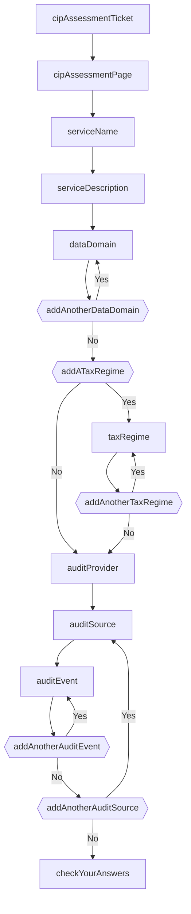
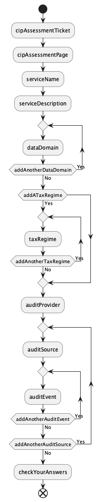

# sbt-journey

**sbt-journey** is an sbt plugin for generating journey applications at HMRC Digital.

It generates code in the style of the [hmrc-frontend-scaffold](https://github.com/hmrc/hmrc-frontend-scaffold.g8) project based upon journey definitions in a journey configuration file.

It generates code for:
* Controllers
* Forms
* Models
* Page objects
* A journey navigator
* A routes file

Interfaces are generated for controllers, forms, and the journey navigator so that you can provide your own implementations.

It can also initialise stub view templates and forms for each of the journey pages as a starting point.

It's intended to help teams to develop an initial skeleton for public-facing services quickly and to get out of the way once it's no longer useful.

## Installation

> [!NOTE]
> In the following instructions, `project/` really does mean a folder called `project/` inside your project folder, not the root folder of your project.
> The `project/` folder is sbt's [meta-build](https://www.scala-sbt.org/1.x/docs/Organizing-Build.html#sbt+is+recursive).

Add the following declaration to `project/plugins.sbt`, replacing `<version>` with the latest sbt-journey version:

```scala
addSbtPlugin("uk.gov.hmrc" % "sbt-journey" % "<version>")
```

Now enable the plugin in your `microservice` project:

```scala
import uk.gov.hmrc.sbt.journey.JourneyPlugin

lazy val microservice = (project in file("."))
  .enablePlugins(PlayScala, SbtDistributablesPlugin, JourneyPlugin)
```

If you wish to generate journey diagrams, add the following to `project/build.sbt`:

```scala
libraryDependencies += "net.sourceforge.plantuml" % "plantuml-asl" % "1.2026.2"
```

## Quick start

Create a new microservice repository, ensuring that it uses the [hmrc-frontend-scaffold](https://github.com/hmrc/hmrc-frontend-scaffold.g8) template.

Create a simple `conf/journey.conf` file:

```hocon
serviceName: <your microservice name>

rootPages {
  index {viewRoute = "/"}
  checkYourAnswers {withDefaultController = false}
}

models {}

journeys {}
```

Execute the `initialiseJourneyViews` task:

```console
$ sbt initialiseJourneyViews
```

Add the `DefaultFormProvidersModule` to your `application.conf`:

```hocon
play.modules.enabled += "<your service's base package>.config.DefaultFormProvidersModule"
```

> [!NOTE]
> This module configures the default form provider implementations to be used in your application.
> Once you are ready to implement your own form validation you should disable this module.
> You can use the `initialiseJourneyForms` [task](#tasks) to help you with this.

Compile your project:

```console
$ sbt compile
```

Now add the generated routes file to your `prod.routes` file:

```diff
->         /<microservice name>            app.Routes
+->        /<microservice name>            journey.Routes
->         /                               health.Routes
```

After making changes to the configuration, you can create view templates for any new pages with the `initialiseJourneyViews` task. Existing view template files will not be overwritten.

## Usage

### Prerequisites

Your application should have been generated with the [hmrc-frontend-scaffold](https://github.com/hmrc/hmrc-frontend-scaffold.g8) template.

If not, then interfaces compatible with the following classes from the template must be available:

* [controllers.actions.IdentifierAction](https://github.com/hmrc/hmrc-frontend-scaffold.g8/blob/main/src/main/g8/app/controllers/actions/IdentifierAction.scala)
* [controllers.actions.DataRetrievalAction](https://github.com/hmrc/hmrc-frontend-scaffold.g8/blob/main/src/main/g8/app/controllers/actions/DataRetrievalAction.scala)
* [controllers.actions.DataRequiredAction](https://github.com/hmrc/hmrc-frontend-scaffold.g8/blob/main/src/main/g8/app/controllers/actions/DataRequiredAction.scala)
* [forms.mappings.Mappings](https://github.com/hmrc/hmrc-frontend-scaffold.g8/blob/main/src/main/g8/app/forms/mappings/Mappings.scala)
* [models.Enumerable](https://github.com/hmrc/hmrc-frontend-scaffold.g8/blob/main/src/main/g8/app/models/Enumerable.scala)
* [models.Mode](https://github.com/hmrc/hmrc-frontend-scaffold.g8/blob/main/src/main/g8/app/models/Mode.scala)
* [models.UserAnswers](https://github.com/hmrc/hmrc-frontend-scaffold.g8/blob/main/src/main/g8/app/models/UserAnswers.scala)
* [templates.Layout](https://github.com/hmrc/hmrc-frontend-scaffold.g8/blob/main/src/main/g8/app/views/templates/Layout.scala.html)

The generated code also makes use of [hmrc-mongo](https://github.com/hmrc/hmrc-mongo).

### Configuration

To use **sbt-journey**, you must add a `journey.conf` file to the `conf/` folder of your [Play Framework](https://www.playframework.com/) project.

The configuration file uses the same [HOCON](https://github.com/lightbend/config/blob/main/HOCON.md) syntax that Play Framework uses for configuration.

An empty **sbt-journey** configuration looks as follows:

```hocon
serviceName: <your service name>

basePackage: <your service's base package>

rootPages {}

models {}

journeys {}
```

The `serviceName` property declares the name of the service. You should use the `appName` from your [application.conf](https://www.playframework.com/documentation/3.0.x/ConfigFile#Configuration-file-syntax-and-features).

The `basePackage` property declares the base package for the service.

You should provide either `serviceName` or `basePackage`. If you provide `serviceName`, the `basePackage` will default to `uk.gov.hmrc.<lower case service name>`.

The `serviceName` is only used to configure the base package, so if you provide `basePackage`, it isn't needed.

The `rootPages` property declares the pages of your application which aren't part of a specific user journey and which don't require the user to submit an answer.

The `models` property can be used to declare `enum` and `case class` models, which are used for conditional navigation and pages which request multiple answers respectively.

The `journeys` property is used to declare the user journeys in your application.

#### Configuring models

Models can take two forms. Models declared as arrays of strings produce `enum`s in the generated code:

```hocon
models {
  TaxRegime: [SA, VAT]
}
```

Models declared as arrays of objects produce `case class`es in the generated code:

```hocon
models {
  AuditEvent: [
    {auditType: String},
    {description: String},
    {expectedGoLiveDate: LocalDate},
    {expectedDecommissioningDate: {Option: LocalDate}}
  ]
}
```

Each object in the array declares a field name and field type.

Fields can use the following Scala types:

* `Int` - generates a numeric entry field
* `Boolean` - generates a yes / no radio button
* `String` - generates a text entry field
* `LocalDate` - generates a date entry field
* `BigDecimal` - generates a currency entry field

Field types can also be marked as optional using the `{Option: <field type>}` syntax.

If you use a fully-qualified class name, **sbt-journey** will accept this, but as it knows nothing about your custom class,
it will be unable to generate default implementations for form providers or create appropriate form inputs in your views.

Additional field types can be added if required.

#### Configuring root pages

The `rootPages` can be configured like so:

```hocon
rootPages {
  index {viewRoute = "/"}
  beforeYouBegin {}
  checkYourAnswers {withDefaultController = false}
}
```

Each entry in the `rootPages` produces a default controller implementation and some parameterless routes. If it is used in a journey then it will also appear in the navigator logic.

The properties of the `rootPages` all have defaults, but the following properties can be used:

* `titleKey` - the key of the page's title in the application's [message files](https://www.playframework.com/documentation/3.0.x/ScalaI18N#Externalizing-messages). Defaults to `<page name>.title`.
* `headingKey` - the key of the page's heading in the application's [message files](https://www.playframework.com/documentation/3.0.x/ScalaI18N#Externalizing-messages). Defaults to `<page name>.heading`.
* `viewRoute` - the route used to navigate to this page. Defaults to the page name in kebab case, e.g. `/check-your-answers`.
* `controllerClass` - the fully-qualified class name of the controller used to render this page. This can be used to completely override the generated controller.
* `viewClass` - the fully-qualified class name of the template used to render this page. This can be used to completely override the generated template name.
* `withDefaultController` - whether to generate a default controller implementation for this page. You may wish to do this if you are adding parameters to the page's view template, which the default controller implementation does not support. If you wish to provide your own implementation then you can extend the `<page name>BaseController` interface generated by **sbt-journey**.

#### Configuring journey pages

The `pages` of a journey can be configured like so:

```hocon
journeys {
  submission {
    pages {
      provideProductDetails {
        answerType = Boolean
      }
      areYouSendingSamples {
        answerType = Boolean
      }
    }
  }
}
```

The only mandatory property is `answerType`, which supports exactly the same syntax and built-in types as the fields of case class `models`.

The other properties of journey pages all have defaults, but the following properties can be used:

* `titleKey` - the key of the page's title in the application's [message files](https://www.playframework.com/documentation/3.0.x/ScalaI18N#Externalizing-messages). Defaults to `<page name>.title`.
* `headingKey` - the key of the page's heading in the application's [message files](https://www.playframework.com/documentation/3.0.x/ScalaI18N#Externalizing-messages). Defaults to `<page name>.heading`.
* `viewRoute` - the route used to navigate to this page in normal mode. Defaults to the page name in kebab case, e.g. `/are-you-sending-samples`.
* `changeRoute` - the route used to navigate to this page in check mode. Defaults to `/change-<kebab case page name>`, e.g. `/change-are-you-sending-samples`.
* `controllerClass` - the fully-qualified class name of the controller used to render this page. This can be used to completely override the generated controller.
* `formProviderClass` - the fully-qualified class name of the form used to validate user submissions on this page. This can be used to completely override the generated form provider.
* `viewClass` - the fully-qualified class name of the template used to render this page. This can be used to completely override the generated template name.
* `withDefaultController` - whether to generate a default controller implementation for this page. You may wish to do this if you are adding parameters to the page's view template, which the default controller implementation does not support. If you wish to provide your own implementation then you can extend the `<page name>BaseController` interface generated by **sbt-journey**.
* `withDefaultFormProvider` - whether to generate a default form provider implementation for this page. If you wish to provide your own implementation then you can extend the `<page name>BaseFormProvider` interface generated by **sbt-journey**.

### Configuring journeys

The journey logic and navigations can be configured like so:

```hocon
journeys {
  submission {
    pages {
      areYouSendingSamples {
        answerType: Boolean
      }
      sampleDetails {
        answerType: String
      }
      addMoreSampleDetails {
        answerType: Boolean
      }
    }

    journey = [
      beforeYouBegin
      {if: areYouSendingSamples, then: {do: sampleDetails, while: addMoreSampleDetails, as: sampleDetails}}
      checkYourAnswers
    ]
  }
}
```

The journey is made up of an array of sequential "parts".

Once a user has completed all the pages of a journey part, they progress to the next part of the journey.

The last part of the journey must be one of the root pages of the application. This might be the "Check Your Answers" page in a typical service.

There are five different kinds of journey part. In all the following examples, the placeholder `...` can stand in for any of the following journey parts:

* `sampleDetails`:

  This kind of journey part declares an individual journey page that the user will visit as they progress sequentially through the journey parts.

  This must reference one of the keys of the `rootPages` or journey `pages`.
* `[..., ...]`:

  This kind of journey part declares a sequential subjourney. The user proceeds from one part to the next.

  Once they have completed all the journey parts then they proceed to the next part in the outer journey.

* `{if: <choicePage>, then: ...}`:

  This kind of journey part declares an optional subjourney. The choice page must have `answerType = Boolean`.

  The user visits the choice page `if` first.

  If they answer the choice page affirmatively then they will progress to the subjourney parts in `then`, otherwise they will progress to the next part in the outer journey.

* `{do: ..., while: <choicePage>, as: <storageKey>}`:

  This kind of journey part declares a looping subjourney. The choice page must have `answerType = Boolean`.

  The user will progress through the subjourney parts in `do` first, then to the choice page `while`.

  If they answer the choice page affirmatively then they will proceed through the subjourney parts in `do` once more, then back to the choice page.

  If they answer the choice page negatively then they will stop looping through the subjourney and progress to the next part in the outer journey.

  The `as` property declares the storage key for the list of answers produced by the user's submissions.

* `{switch: <choicePage>, case: {...}}`:

  This kind of journey part declares a split subjourney. The choice page must have an `answerType` referencing an enum model from the `models`.

  The user visits the choice page `switch` first.

  Depending upon their answer, they will proceed to the journey parts of one of the `case` subjourneys.

  For example, for the `TaxRegime` model declared above, the following journey might be used:

    ```hocon
    {switch: whichTaxRegime, case: {SA: ..., VAT: ...}}
    ```

  If the user chooses the `SA` tax regime on the `whichTaxRegime` page, then they progress to the `SA` subjourney parts.

  If the user chooses the `VAT` tax regime on the `whichTaxRegime` page, then they progress to the `VAT` subjourney parts.

  Once they have completed the relevant subjourney parts for their choice then they proceed to the next part in the outer journey.

### Tasks

This plugin contributes several sbt tasks once it is enabled:

* `initialiseJourneyViews`      - Creates Twirl view templates for each of the `rootPages` and journey `pages` in your application that do not have such a template already.
* `overwriteJourneyViews <Y/N>` - Identical to the above task except that it overwrites any existing templates for your pages.
* `initialiseJourneyForms`      - Creates a form provider class for each of the journey `pages` in your application that does not have such a class already.
* `overwriteJourneyForms <Y/N>` - Identical to the above task except that it overwrites any existing form provider classes for your pages.
* `generateJourneyDiagrams`     - Generates PlantUML and Mermaid.js source code describing the structure of each of your `journeys`. If you have configured a PlantUML dependency, it also generates PNG images.

## How it works

Before your application is built via sbt's `compile` task, **sbt-journey** reads the `journey.conf` configuration file and generates various different classes into sbt's generated source folders:

* Answer Models - case classes and enums generated based upon the declarations in the `models` property.
* Journey Models - case classes and enums which represent the hierarchy of user answers in a given `journey`.
* FormProviders - provider objects which create `Form`s which validate the answer provided by the user on each page of
  the journey.
* Pages - page objects which represent the path of a particular page's answer in the `UserAnswers`
* JourneyNavigator - a navigator object which determines the next controller method to `Call` based upon the current journey `Page` and the `UserAnswers`.
* journey.routes - a Play Framework [routes file](https://www.playframework.com/documentation/3.0.x/ScalaRouting#The-routes-file-syntax) which declares routes for each of the `pages` in all of the `journeys`.
* Controllers - controllers which render the application's `View`s, validate `Form` submissions, save `UserAnswers` using `Page` objects and then ask the `JourneyNavigator` to redirect the user to the next page.

## Sample diagrams

The Mermaid diagrams look like this:



The PlantUML diagrams look like this:



## License

This code is open source software licensed under
the [Apache 2.0 License]("http://www.apache.org/licenses/LICENSE-2.0.html").
